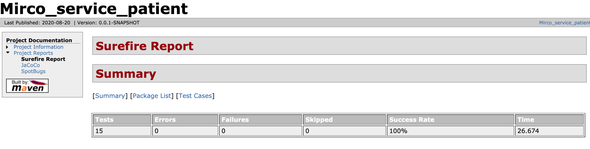
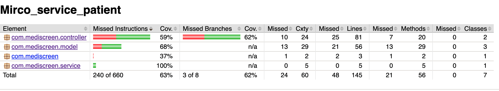

# Micro Service Patient
> Permet de gérer l'ajout et la modification des patients. Il permet également de voir la liste de tous les patients.

> Port d'écoute : 9001

# Rapports de tests

# Rapport de couverture

